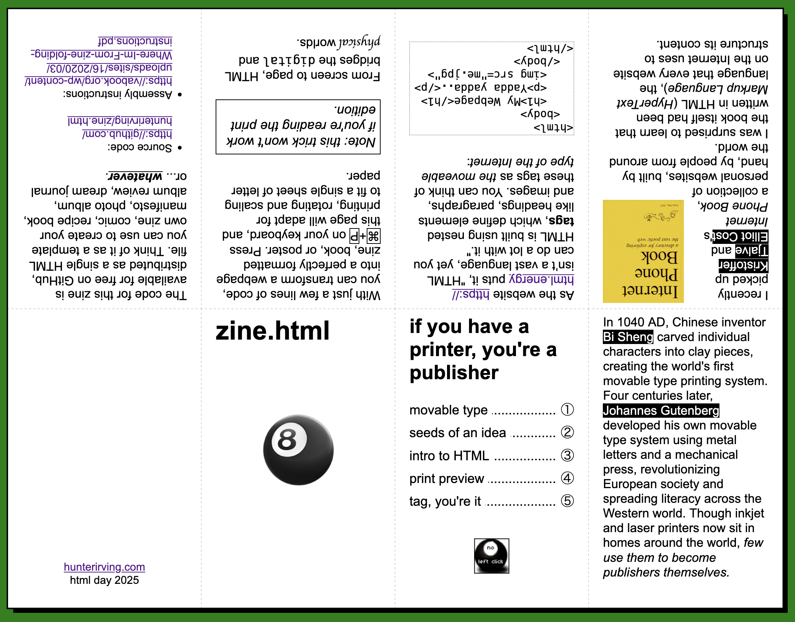
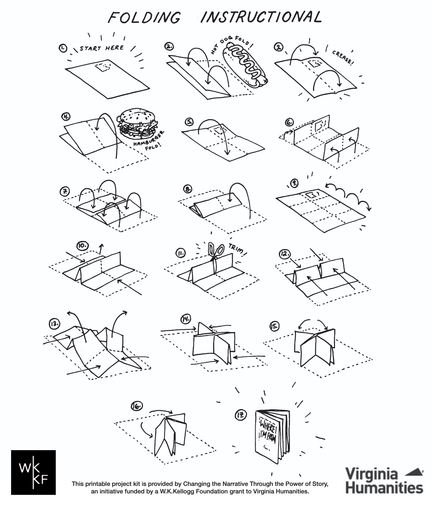

# What if you could hold a website?
Open ```zine.html``` in your web browser (or <a href="https://hunterirving.github.io/zine.html/zine.html">click here</a>) then use ```⌘``` + ```P``` to print an 8-page mini zine to one sheet of 8.5 x 11" legal paper.



>[!NOTE]
>For best results, in your system print dialog...
>- ensure Portrait orientation is selected
>- set Margins to None or 0
>- select "Scale 100%" rather than "Fit to page width"
>- check "Print backgrounds" to ensure proper styling


## Assembly Instructions

Once you've printed the blank, follow this assembly guide from <a href="https://vabook.org/wp-content/uploads/sites/16/2020/03/Where-Im-From-zine-folding-instructions.pdf">Virginia Center for the Book</a> to cut and fold the zine to shape:

<a href="https://vabook.org/wp-content/uploads/sites/16/2020/03/Where-Im-From-zine-folding-instructions.pdf">
    
</a>

>[!TIP]
>Once folded, consider gluing opposite pages together with a gluestick for increased structural stability.

# It's Your Zine Now
1. open ```template.html``` in your text editor of choice
2. modify the HTML within the existing ```.zine-page-content``` divs
3. open the modified file in your favorite web browser
4. hit print!
